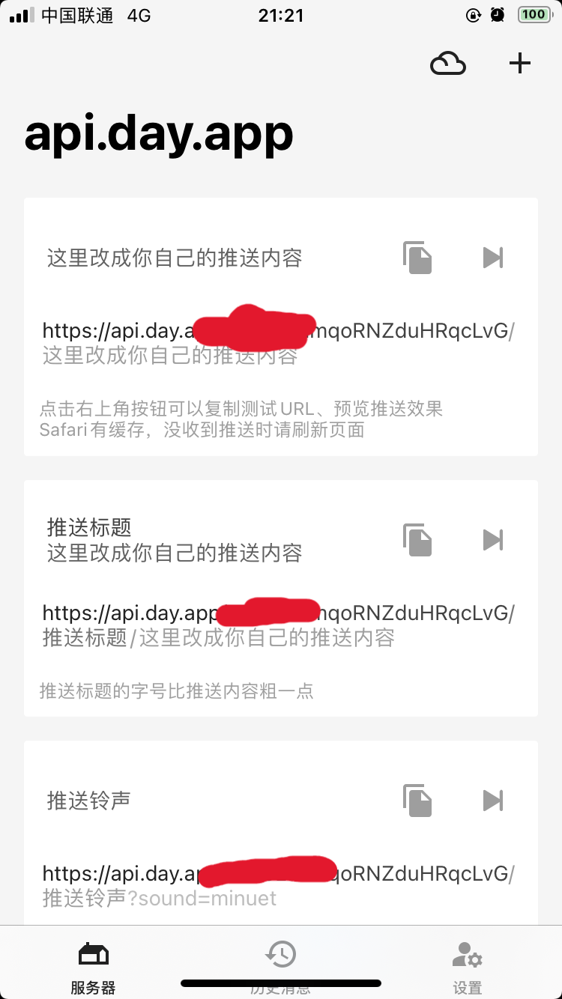

# Electricity Checker
Electricity Checker是一个查询电费并推送到手机的 Python 脚本，它可以从学校的电费查询网站获取电费信息，并通过Bark推送到用户的手机。该脚本旨在帮助用户及时了解自己的电费情况，避免因余额不足而导致停电的情况发生。
## 用法
在这里提供如何使用该脚本的简要说明。包括如何安装、配置和运行脚本的说明。也可以提供一些示例用法。
### 说明
部署在本地可以随时运行查看  
如需定时运行脚本，推荐部署在GitHub Actions  
#### 关于Bark key的获取
目前Bark只有ios端  
[Bark](https://apps.apple.com/cn/app/bark-%E7%BB%99%E4%BD%A0%E7%9A%84%E6%89%8B%E6%9C%BA%E5%8F%91%E6%8E%A8%E9%80%81/id1403753865)  
打开Bark并给予相应权限，第一行即为你的Bark key。  

## 目录
 - [部署在本地](#部署在本地)
 - [部署在GitHub Actions](#部署在GitHub-Actions)
### 部署在本地
如果你需要部署在本地运行
- 首先下载Electricity_Checker.py
- 设置自己的配置
在运行脚本之前，您需要设置以下变量：
```
BARK_URL：Bark服务器的URL。
DYID：您的DYID。
PID：您的PID。
```
`建议修改为如图配置`  

- 运行脚本  
设置好环境变量后，您可以使用以下命令来运行脚本：
```python
python Electricity_Checker.py
```
脚本运行后，会从学校的电费查询网站获取电费信息，并将查询结果推送到您的手机上。
### 部署在GitHub Actions
- 首先Fork本仓库
- 设置环境变量  
在运行脚本之前，您需要设置以下环境变量：
```
BARK_URL：Bark服务器的URL。
DYID：您的DYID。
PID：您的PID。
```
依次点击 `Settings` -> `Secrets and variables` -> `Actions` -> `New repository secret` 创建环境变量  
  
  
  
  

- 设置定时运行(可根据自己需要修改)  
修改自己仓库的`main.yml`中的cron表达式  
本脚本设置在每天的22:00运行
- 运行脚本测试
依次点击 `Actions` -> `Electricity Notification` -> `Run workflow`  
  
稍微等待一分钟，打开查看运行结果。  
  
直至出现Success即可
### 预览截图

